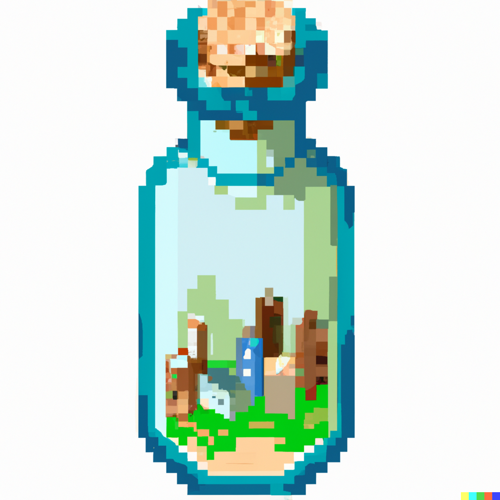

  <h1 align="center">Bottleworld: Your World in Miniature</h1>
  

    

    
  

## About BottleWorld

BottleWorld uses GPT-4 to create multiple agents who simulate social interactions in various situations. These scenarios range from parties and proposals to job interviews and work dinners. The primary objective of this project is to explore how AI models can aid in understanding and predicting social dynamics based on parameters like individual personalities, knowledge, motivations, and incentives.

## Getting Started

To dive into BottleWorld, follow these steps:

1. Clone the project repository to your local machine.
2. Navigate to the repository: `cd bottleworld`.
3. Run `python setup.py` to check your environment setup and configure it as needed.
4. Update the environment variables in `.env` with your OpenAI API Keys. You can obtain an OpenAI API key [here](https://beta.openai.com/signup/). Adding API it keys for optional services will enable the use of other tools.
5. Launch the simulation by running `poetry run world`.
6. For cost-effective simulation, use `poetry run world --turbo`. This will use gpt3.5-turbo for all LLM calls, which is significantly cheaper but may yield lesser quality results.

Now you can watch your social situations in action and observe as the agents interact with each other, making decisions based on their assigned personalities, knowledge, motivations, and incentives.

## How It Works

BottleWorld utilizes multiple agents, each equipped with a memory, that interact with one another. Each agent's behavior is driven by the personality, knowledge, motivations, and incentives assigned to them. Agents navigate the simulation and engage with others, acting out the social situation based on the parameters set.

## Viewing Agents

BottleWorld is bustling with activity! To get a view of what different agents are doing whilst the simulation is running, you can visit the `agents/` folder where there is a txt file for each agent containing a summary of their current state.

## Modifying the Simulation

To modify the simulation, all you need to do is:

1. Make changes to the `config.json` by updating the available agents or situations.
2. Reset your database: `poetry run db-reset`.
3. Run the simulation again: `poetry run world`.

## Using with Anthropic Claude

Ensure you have an `ANTHROPIC_API_KEY` in your env, then you can use `poetry run world --claude` which will run the simulation using claude-v1 for some calls and claude-v1-instant for others.

## Using
